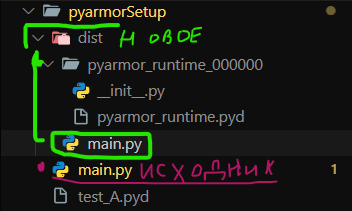
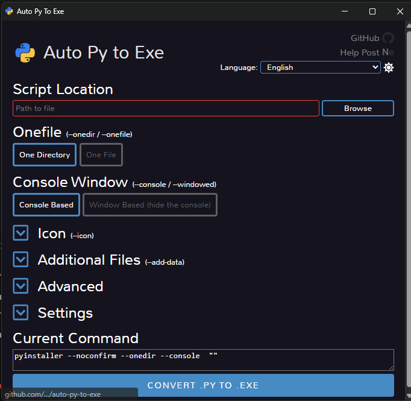
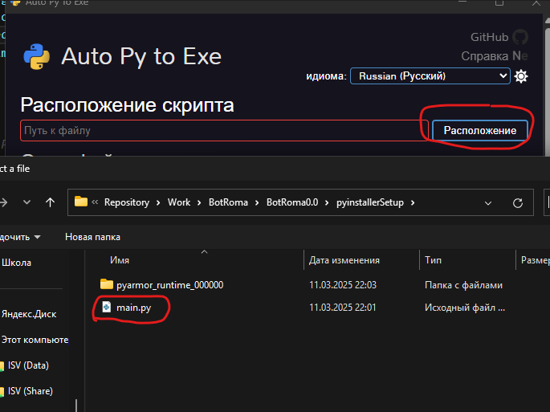
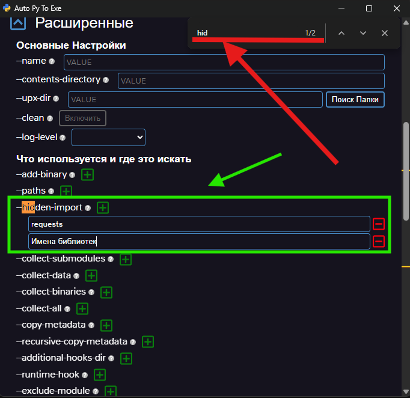
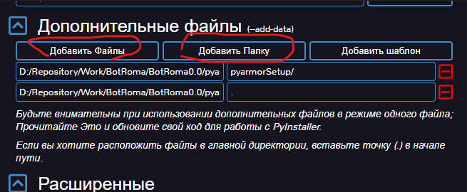
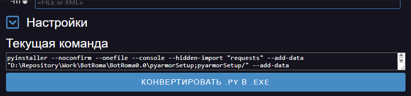
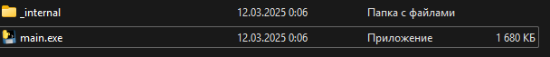
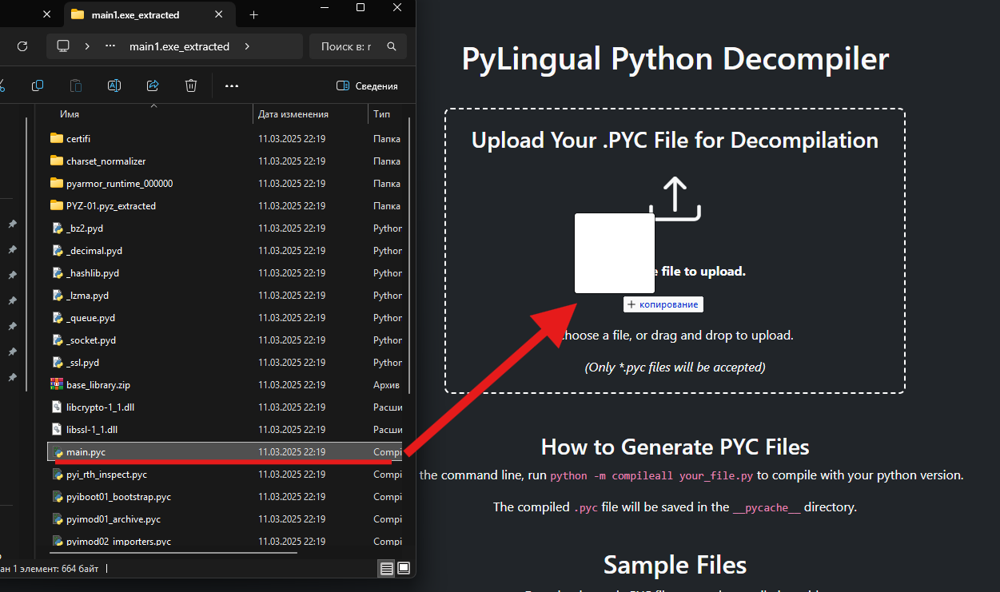
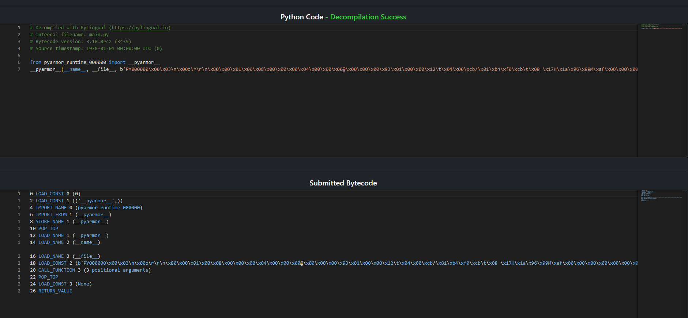

# 🔐 Шифрование и компиляция пайтон кода
[](https://t.me/robgud)
[](https://www.youtube.com/@Robin_Good_Admin)

Python-обертка для работы с API мессенджера Pachca. Поддержка сообщений, кнопок и истории чатов.


#### 
⚠️ **Важное уведомление:** 
*Используя материалы данного репозитория, вы соглашаетесь с условиями*  
[**Пользовательского соглашения**](./user_agreement.md).  


## 📦 Установка зависимостий
```python
pip install Cython  #для создания модулей
pip install pyarmor #обфускации файла
pip install pyinstaller  #для создания EXE через консоль
pip install auto-py-to-exe #после первого импорта можно добавить создания EXE через интерфейс
```
# 💾 Создание модулей аналог `.dll` в C#

Чтобы создать модуль, создайте файл с именем `test_A.pyx` и используйте расширение `.pyx`. Рекомендуется также создать файл `pyarmorSetup`.


## 📟 Пишем в нем код + можно использовать такие приколы как

```Скрытая функция```
```python
cdef int private_func(int a, int b):
    return a + b
```

``` Скрытая переменная```
```python
cdef str __TOKEN = '123123123123'
```

``` Функция main которую можно вызвать ```
```python
def main():
```

```cdef Нужна как инкапсуляция в  C#```


## 🚷 Чем грозит не использование данной технологии Без этого функцию можно вытащить таким примером


### 📝 Вытаскивает все директории внутри переменные и функции
```python
print(dir(test_A)) # Вытаскивает все директории внутри переменные и функции
```
``` Пример результата:```
```python
['__TOKEN', '__all__', '__builtins__', '__doc__', '__file__', '__loader__', '__name__',
'__package__', '__spec__', '__test__', 'main', 'requests']
```


### 🔍 Вытаскивает Данные из переменной __TOKEN
```python
print(test_A.__TOKEN) # Вытаскивает Данные из переменной __TOKEN
```
``` Пример результата:```
```python
123123123123
```

### 📕 Вытаскивает Данные из документации файлов
```python
print(test_A.__doc__) # Вытаскивает Данные из документации файлов
```
## 📩 Компиляция файла в код "C"
`python setup.py build_ext --inplace`

`setup.py = Имя файла`
```python
import test_A

if __name__ == '__main__':
    test_A.main()
```
# 🔐 Шифровка Main файла

### 🔗 Импорт нужной библиотеки
`pip install pyarmor`

------


### 📫 Команда для обфускации файла
`pyarmor gen .\main.py`


Частые ошибки:
- Убедитесь что вы находитесь в нужной директории
- Убедитесь в коректном имени файла и деректории
    
### 🔒 Пример файла после обфускации

```python
# Pyarmor 9.1.1 (trial), 000000, non-profits, 2025-03-11T23:17:01.554018
from pyarmor_runtime_000000 import __pyarmor__
__pyarmor__(__name__, __file__, b'PY000000\x00\x03\n\x00o\r\r\n\x80\x00\x01\x00\x08\x00\x00\x00\x04\x00\x00\x00@\x00\x00\x00\x93\x01\x00\x00\x12\t\x04\x00\xa19<\x936\xe2E\xa9\x05\x9c\xeeC\xe0\xc9\xe2x\x00\x00\x00\x00\x00\x00\x00\x00M\xd1\xce\xbb\xf0\xb7)\x0f\xb6\x83\xce\xf9\xf2\xcdJ\xfc+uk\x80Xx\xdaE\xfe2|\x89\xac\xafV-\x0c\x8c\x17\xed\x83[\x87]\xd9\xd0\x8e\xff\xb1Z\xcd\xe4)\xb7Al*\x95\x13\xfdd\xd6\xb6\xf51\x02\x82xg\x06M\x94\x0c9\xdf\x8b\x18[3>\xd3\\\x18\xacC\xd8\x02\xbc\xd5\xa5a\xe6\x10\xeb\x0f\x12\x0b\x08\x88\xff\x84\xe3 \xd6\xc6[\x03/\x84g0\x0b.\xb0x\xda\xbd<\x00\xe8DWp{\x8c\xc4\x08\xba\xcf\xd1@b\xa4\x0b\xec&\xd3\x89\xe3k\xb5\xb6\xb4f8$\xb2\xcf\x89\xea\'\x9ar\xe1\xd8\xb2\x85\xa8\xdf\x07\xbdnr\xfb\xa5\xac\x95\xc0%\xc0\x1c\x1ch\xc7\x96Lk\xa7\xc5\x84\x18\x86\xfc\x1e\x02p\xf2\x95A\xb9C\xee\x85[\xa6\xfeT\t\x9eJ\xc0\x98\x87\xe3DH\xe0W\xcc\xfa\xc8\x8d\xde\x8e\xc3I\xda\xfc\x0b\\\xed5\xc9\xb2i\x82\xa0\x8e\xc7W\xc5\xb04w\xc3B\xa6\xf8L\xd7\x964\xbb\xdc\xeaM;z8\xd8\xc9!\xc08@"\xee\x04\xf7\xce/\xfe\x05u\x0c\xa0gD=\x9e\xb6t\x17<-\xe0\xf5\xc6\xeds\xf5\xd2\xe3MSc/\xd45\xb9\xa5\xbdwi\x0f\x1ehe\xbdm8\xe2!\xa9\xf4B\x9bmH\x16\xbf\x98\x0f\x82\xbc\x1d\x7fEYzY<\x9b\xa9\xfe\x16\xbc\x04#R\xe8\xa0cH\xd3\xe6\xf5\x0e\xbd\x8d\x00r\xee\x99\xfb\x93m<J\xec\xed\xacU\xb9P\xc6\x92\x8c\x84\xef{\xddh\xdd\r\\\x19\xab\xd8f\xd7=}\xc7\xa03C\xc9\xd8\x97/\x0e\xb0\xf0\xe6J\xb2\x07\xe3\n`\nFc\x858\x87q\xb9OA\x10\xc5&!w\xa1')

```


Как видно создался новый файл теперь запихаем всё в .exe


# ✏️ Запихивание файлов в EXE
### 🔗 Нужный импорт

```python
pip install pyinstaller  #для создания EXE через консоль
pip install auto-py-to-exe #после первого импорта можно добавить создания EXE через интерфейс
```
## 📺 Запуск Интирфейса 
### 📟 Команда в CMD
`auto-py-to-exe.exe`



Запускается такой интерфейс здесь можно выбрать нужные настройки
Выбираем базовые настройки (Там не сложно)

### ❗️ВАЖНО❗️
Выбираем главный запускаемый файл



Выбрать отдельно библиотеки как на примере



Добавляем файл с папкой где находятся наши модули а затем сами модули



И запускаем 



#### 📟 Можно запускать и без интерфейса

# 💣 Реверс кода

Можно посмотреть 1 EXE файл или рядом есть ещё файлы



## 💊 Если такого фала нет то запускаем следующий скрипт
`Файл прекреплен (pyinstxtractor.py)`

.\pyinstxtractor.py .\main.exe


main.exe Имя файла 
Скрипт должен быть в одной директории с фалом 
После этой команды у нас появится фалик с теми же самыми внутренности что и в первом случаее


### 🪬 Затем можем отдельно прореверсить каждый фал с расширением `".pyc"` на сайте 
[PyLingual](https://pylingual.io/)

### №Пример:
Я решил реверсить файл main





Хорошо сайт взломал файл но внутри у нас всё зашифровано с помощью библиотеки pyarmor  которую я использовал в примере выше


# 💬 Поддержка и обсуждение
## Присоединяйтесь к нашим сообществам для вопросов по теме:
### [Telegram Chat](https://t.me/ChatRobinGood)
